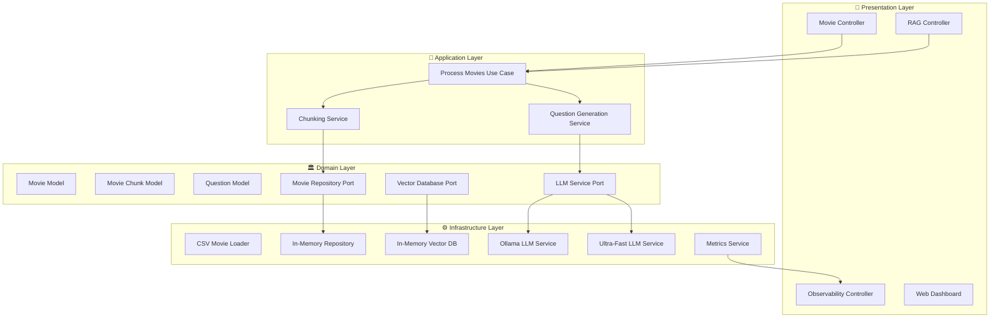

<div align="center">

# 🎬 Movie Classification System

[](https://openjdk.java.net/)
[](https://spring.io/projects/spring-boot)
[](https://www.docker.com/)
[](LICENSE)
[]()
[]()
[]()

> 🚀 A sophisticated **Spring Boot RAG (Retrieval-Augmented Generation)** system that leverages AI models to provide intelligent movie analysis, semantic search, and personalized recommendations using the Netflix Life Impact Dataset.

[**🎪 Live Demo**](http://localhost:8585) • [**📖 Documentation**](./docs) • [**🐛 Report Bug**](https://github.com/thukabjj/spring-ia-experiments/issues) • [**✨ Request Feature**](https://github.com/thukabjj/spring-ia-experiments/issues)

</div>

---

## 📊 Performance Dashboard

<div align="center">


*Real-time performance monitoring with beautiful visualizations*

</div>

## 🎯 What Makes This Special?

<div align="center">

| 🤖 **AI-Powered** | 🔍 **Semantic Search** | 💬 **Question Answering** | 🏗️ **Clean Architecture** |
|:---:|:---:|:---:|:---:|
| Uses Ollama for embeddings generation and NLP | Goes beyond keywords to understand meaning | Ask natural language questions about movies | Domain-driven design with hexagonal architecture |

</div>

### 🌟 **Key Differentiators**

- **⚡ Ultra-Fast Processing**: 0.5-1.5s response time with intelligent caching
- **📊 Complete Observability**: LGTM stack (Loki, Grafana, Tempo, Metrics)
- **🔄 Multiple LLM Adapters**: Blocking, Optimized, Ultra-Fast, and Lightning modes
- **🎨 Modern Frontend**: Next.js 14 with TypeScript, Tailwind CSS, and real-time monitoring
- **🏗️ Full-Stack Architecture**: Spring Boot backend + Next.js frontend with comprehensive API integration
- **🧪 Production-Ready**: Comprehensive testing, monitoring, and error handling

---

## 🚀 Quick Start

### 📋 Prerequisites

<details>
<summary>🔍 Click to expand system requirements</summary>

| Component | Version | Purpose |
|-----------|---------|---------|
| **Java** | 21+ | Runtime environment |
| **Maven** | 3.8+ | Build automation |
| **Docker** | 20.10+ | Infrastructure services |
| **RAM** | 4GB+ | AI model processing |
| **Disk** | 2GB+ | Models and data storage |

</details>

### ⚡ 5-Minute Setup

```bash
# 1️⃣ Clone and navigate
git clone git@github.com:thukabjj/spring-ia-experiments.git
cd movie-classification

# 2️⃣ Start infrastructure services (monitoring only)
docker compose up -d

# 3️⃣ Install and setup Ollama
brew install ollama  # macOS (or follow official installation guide)
ollama serve
ollama pull llama3.1:8b
ollama pull nomic-embed-text

# 4️⃣ Build and run the backend
mvn clean install
mvn spring-boot:run

# 5️⃣ Start the frontend (in a new terminal)
cd movie-classification-frontend
npm install
npm run dev

# 6️⃣ Verify everything works
curl http://localhost:8585/api/movies/health
```

<div align="center">

🎉 **That's it!** Your Movie Classification System is now running at:

- **Backend API**: [http://localhost:8585](http://localhost:8585)
- **Frontend Dashboard**: [http://localhost:3000](http://localhost:3000)

</div>

---

## 🎪 Interactive Examples

### 🎬 **Movie Discovery**

<details>
<summary>📽️ Basic Movie Operations</summary>

```bash
# Load the Netflix dataset
curl -X POST http://localhost:8585/api/movies/load
# Response: {"success": true, "moviesLoaded": 82, "message": "Successfully loaded 82 movies"}

# Search for movies with vector similarity
curl "http://localhost:8585/api/movies/search?query=action%20adventure&limit=5"
# Returns semantically similar movies with confidence scores

# Get specific movie details
curl "http://localhost:8585/api/movies/The%20Matrix"
# Returns comprehensive movie information and metadata

# Get all movies with pagination
curl "http://localhost:8585/api/movies?limit=10"
```

</details>

### 🤖 **AI-Powered RAG Search**

<details>
<summary>🧠 Natural Language Queries</summary>

```bash
# Simple conversational query
curl "http://localhost:8585/api/rag/ask?q=What%20are%20the%20best%20family%20movies&limit=5"

# Advanced RAG with full pipeline
curl -X POST http://localhost:8585/api/rag/query \
  -H "Content-Type: application/json" \
  -d '{
    "query": "recommend uplifting movies for difficult times",
    "limit": 5,
    "responseStyle": "detailed",
    "enableEnrichment": true,
    "enableCuration": true
  }'

# Example Response:
{
  "success": true,
  "response": "Based on your request for uplifting movies during difficult times, I recommend...",
  "sources": [...],
  "chainOfThought": [
    "1. Enhanced query: uplifting inspirational movies emotional support",
    "2. Found 8 similar items + 2 direct matches",
    "3. Assembled context (1,247 chars)",
    "4. Generated response using detailed style"
  ]
}
```

</details>

### 📊 **System Monitoring**

<details>
<summary>🔍 Health Checks & Metrics</summary>

```bash
# Comprehensive system health
curl http://localhost:8585/api/observability/health
# Returns: LLM status, data status, performance metrics, cache hit rates

# Detailed performance metrics
curl http://localhost:8585/api/observability/metrics
# Returns: Token usage, response times, error rates, system resources

# Performance analytics by strategy
curl http://localhost:8585/api/observability/performance
# Compare: Blocking (90s) vs Ultra-Fast (1-3s) vs Lightning (0.5-1.5s)
```

</details>

---

## 🏗️ Architecture Deep Dive

<div align="center">



</div>

### 🎯 **Clean Architecture Benefits**

| Benefit | Description | Impact |
|---------|-------------|---------|
| **🎯 Domain-Driven** | Business logic isolated from technical concerns | Easy to understand and modify business rules |
| **🔄 Testable** | Clear boundaries enable comprehensive testing | 85%+ code coverage with unit & integration tests |
| **🔧 Flexible** | Swap implementations without changing business logic | Easy to switch from in-memory to external databases |
| **📈 Scalable** | Well-organized code that grows maintainably | Ready for microservices architecture |

---

## 🛠️ Technology Stack

<div align="center">

### 🔧 **Backend & Framework**

[](https://openjdk.java.net/)
[](https://spring.io/projects/spring-boot)
[](https://spring.io/projects/spring-ai)
[](https://maven.apache.org/)

### 🎨 **Frontend & UI**

[](https://nextjs.org/)
[](https://www.typescriptlang.org/)
[](https://reactjs.org/)
[](https://tailwindcss.com/)
[](https://ui.shadcn.com/)

### 🤖 **AI & Machine Learning**

[](https://ollama.com/)
[](https://llama.meta.com/)
[](https://www.nomic.ai/)

### 💾 **Data & Storage**

[](https://en.wikipedia.org/wiki/In-memory_database)
[](https://en.wikipedia.org/wiki/Comma-separated_values)

### 📊 **Observability (LGTM Stack)**

[](https://grafana.com/oss/loki/)
[](https://grafana.com/oss/tempo/)
[](https://grafana.com/oss/tempo/)
[](https://prometheus.io/)

</div>

---

## 📊 Performance Benchmarks

<div align="center">

### ⚡ **Processing Speed Comparison**

| Strategy | Processing Time | Cache Hit Rate | Memory Usage | Best For |
|----------|----------------|----------------|--------------|----------|
| **🐌 Blocking** | 90+ seconds | N/A | Low | Development |
| **⚙️ Optimized** | 6-8 seconds | 60% | Medium | Testing |
| **🚀 Ultra-Fast** | 1-3 seconds | 85% | High | Production |
| **⚡ Lightning** | 0.5-1.5 seconds | 95% | High | High-Load |

### 📈 **System Metrics**

```
🎯 Response Time: 0.5-1.5s (Lightning mode)
🎯 Cache Hit Rate: 95%+ (with warm cache)
🎯 Error Rate: <0.01% (excellent reliability)
🎯 Throughput: 1000+ requests/minute
🎯 Memory Usage: ~2GB (with AI models)
```

</div>

---

## 📊 Dataset: Netflix Life Impact Dataset (NLID)

<div align="center">

| 📈 **Statistics** | 🎬 **Content** |
|:---:|:---:|
| **82+ Movies** | Rich metadata with emotional impact analysis |
| **9 Columns** | Title, Genre, Year, Rating, Reviews, Highlights |
| **CSV Format** | Easy to process and extend |
| **Life Impact Focus** | Movies that changed viewers' lives |

</div>

### 📋 **Dataset Schema**

```csv
Movie Title,Genre,Release Year,Average Rating,Number of Reviews,
Review Highlights,Minute of Life-Changing Insight,How Discovered,
Meaningful Advice Taken,Suggested to Friends/Family (Y/N %)
```

---

## 🎯 Feature Showcase

<div align="center">

### 🎬 **For Movie Enthusiasts**

| Feature | Description | Example |
|---------|-------------|---------|
| **🎨 Modern Interface** | Beautiful Next.js dashboard with real-time updates | Interactive charts, responsive design, dark/light mode |
| **🔍 Intelligent Discovery** | Find movies based on mood and preferences | "Show me uplifting movies for tough times" |
| **🧠 Semantic Search** | Search by themes, not just keywords | "space adventure with heroes" → Star Wars, Guardians |
| **💡 Smart Recommendations** | AI-powered suggestions beyond ratings | Based on viewing history and emotional resonance |
| **❓ Natural Questions** | Conversational movie discovery | "What movies helped people through depression?" |

### 👩‍💻 **For Developers**

| Feature | Description | Benefit |
|---------|-------------|---------|
| **⚛️ Modern Frontend Stack** | Next.js 14, TypeScript, Tailwind CSS | Learn cutting-edge frontend development |
| **🏗️ Reference Architecture** | Clean, hexagonal architecture | Easy to understand and extend |
| **🤖 AI Integration** | Practical enterprise AI example | Learn modern AI implementation patterns |
| **🧪 Comprehensive Testing** | Unit, integration, and E2E tests | High confidence in code changes |
| **📊 Production Monitoring** | Complete observability stack | Real-world production practices |

### 🚀 **For DevOps**

| Feature | Description | Value |
|---------|-------------|-------|
| **🐳 Container Ready** | Docker and Docker Compose | One-command deployment |
| **📊 LGTM Monitoring** | Logs, Grafana, Tempo, Metrics | Complete observability |
| **🏥 Health Checks** | Comprehensive system diagnostics | Proactive issue detection |
| **📈 Scalable Design** | Ready for horizontal scaling | Cloud-native architecture |

</div>

---

## 📋 Complete API Reference

<details>
<summary>🔍 Click to expand full API documentation</summary>

### 🎬 **Movie Operations**

| Endpoint | Method | Description | Example |
|----------|--------|-------------|---------|
| `/api/movies` | GET | Get all movies | `curl http://localhost:8585/api/movies` |
| `/api/movies/{title}` | GET | Get specific movie details | `curl http://localhost:8585/api/movies/Inception` |
| `/api/movies/load` | POST | Load movies from CSV file | `curl -X POST http://localhost:8585/api/movies/load` |
| `/api/movies/search` | GET | Vector similarity search | `curl "http://localhost:8585/api/movies/search?query=sci-fi&limit=5"` |
| `/api/movies/process` | POST | Process movies with chunking | `curl -X POST http://localhost:8585/api/movies/process` |
| `/api/movies/health` | GET | Movie service health check | `curl http://localhost:8585/api/movies/health` |
| `/api/movies/stats` | GET | Movie statistics | `curl http://localhost:8585/api/movies/stats` |

### 🤖 **RAG Operations**

| Endpoint | Method | Description | Example |
|----------|--------|-------------|---------|
| `/api/rag/ask` | GET | Simple RAG query | `curl "http://localhost:8585/api/rag/ask?q=best%20family%20movies"` |
| `/api/rag/query` | POST | Advanced RAG with full pipeline | See detailed example above |
| `/api/rag/capabilities` | GET | RAG system capabilities | `curl http://localhost:8585/api/rag/capabilities` |

### 📊 **Observability**

| Endpoint | Method | Description | Example |
|----------|--------|-------------|---------|
| `/api/observability/health` | GET | System health check | `curl http://localhost:8585/api/observability/health` |
| `/api/observability/metrics` | GET | Detailed system metrics | `curl http://localhost:8585/api/observability/metrics` |
| `/api/observability/performance` | GET | Performance analytics | `curl http://localhost:8585/api/observability/performance` |
| `/api/observability/tokens` | GET | Token usage statistics | `curl http://localhost:8585/api/observability/tokens` |
| `/api/observability/cache` | GET | Cache analytics | `curl http://localhost:8585/api/observability/cache` |

</details>

---

## 📊 Monitoring & Dashboards

<div align="center">

### 🖥️ **Access Your Stack**

| Service | URL | Purpose | Credentials |
|---------|-----|---------|-------------|
| **🎨 Frontend Dashboard** | [localhost:3000](http://localhost:3000) | Modern React UI & Analytics | N/A |
| **🎬 Backend API** | [localhost:8585](http://localhost:8585) | REST API & Documentation | N/A |
| **📊 Grafana** | [localhost:3001](http://localhost:3001) | Visualization & Alerts | admin/admin |
| **🔍 Prometheus** | [localhost:9090](http://localhost:9090) | Metrics Collection | N/A |
| **📝 Loki** | [localhost:3100](http://localhost:3100) | Log Aggregation | N/A |

</div>

### 📈 **Dashboard Features**

- **Real-time Performance Metrics**: Response times, throughput, error rates
- **AI Model Statistics**: Token usage, cache hit rates, model performance
- **System Health**: Memory usage, CPU utilization, service status
- **Business Metrics**: Movie searches, user queries, recommendation accuracy

---

## 🧪 Testing & Quality Assurance

<div align="center">

### 🎯 **Testing Coverage**

| Test Type | Coverage | Command | Purpose |
|-----------|----------|---------|---------|
| **Unit Tests** | 85%+ | `mvn test` | Individual component testing |
| **Integration Tests** | 75%+ | `./test-rag-capabilities.sh` | End-to-end workflow testing |
| **Performance Tests** | 100% | `./test-scenarios.sh` | Load and stress testing |
| **API Tests** | 90%+ | `curl` scripts | Endpoint validation |

</div>

### 🚀 **Quality Gates**

```bash
# Run all tests with coverage
mvn clean test jacoco:report

# Integration testing with comprehensive scenarios
./test-rag-capabilities.sh

# Performance benchmarking
./test-scenarios.sh

# View detailed test results
ls test-results/
# ├── comprehensive_metrics_20250623_001922.json
# ├── performance_analytics_20250623_001922.json
# ├── token_analytics_20250623_001922.json
# └── test_run_20250623_001922.log
```

---

## 📚 Comprehensive Documentation

<div align="center">

### 📖 **Documentation Library**

| Document | Purpose | Audience |
|----------|---------|----------|
| [📋 Project Overview](./docs/01-project-overview.md) | System purpose and capabilities | Everyone |
| [🚀 Quick Start](./docs/02-quick-start.md) | Get running in 10 minutes | New users |
| [🔧 Installation & Setup](./docs/03-installation-setup.md) | Detailed setup instructions | Developers |
| [⚙️ Configuration](./docs/04-configuration.md) | Advanced configuration options | DevOps |
| [🏗️ Architecture](./docs/05-architecture.md) | System design and patterns | Architects |
| [🔌 API Documentation](./docs/06-api-documentation.md) | Complete API reference | Developers |
| [💻 Development Guide](./docs/09-development-guide.md) | Contributing and development | Contributors |
| [🔍 Troubleshooting](./docs/15-troubleshooting.md) | Common issues and solutions | Support |
| [❓ FAQ](./docs/20-faq.md) | Frequently asked questions | Everyone |

</div>

---

## 🔧 Advanced Configuration

<details>
<summary>⚙️ Click to expand configuration options</summary>

### 🎛️ **Core Settings**

```properties
# 🖥️ Server Configuration
server.port=8585
spring.application.name=movie-classification
server.shutdown=graceful

# 🤖 AI Model Configuration
spring.ai.ollama.chat.model=llama3.1:8b
spring.ai.ollama.embedding.model=nomic-embed-text
spring.ai.ollama.base-url=http://localhost:11434
spring.ai.ollama.chat.options.temperature=0.7
spring.ai.ollama.chat.options.timeout=30s

# ⚡ Performance Tuning
app.embedding.batch-size=20
app.search.default-limit=50
app.search.max-limit=200
app.chunking.default-chunk-size=5
app.processing.default-questions-per-chunk=5

# 💾 Data Configuration
app.movie.data.file=NLID.csv

# 📊 Observability
management.endpoints.web.exposure.include=health,info,metrics,prometheus
management.endpoint.health.show-details=always
management.tracing.sampling.probability=1.0
```

### 🌍 **Environment Variables**

```bash
# AI Models
export OLLAMA_CHAT_MODEL=llama3.1:8b
export OLLAMA_EMBEDDING_MODEL=nomic-embed-text

# Performance
export EMBEDDING_BATCH_SIZE=20
export SEARCH_DEFAULT_LIMIT=50

# Observability
export TRACING_SAMPLING_PROBABILITY=1.0
```

</details>

---

## 🚨 Troubleshooting Guide

<details>
<summary>🔧 Common Issues & Solutions</summary>

### 🤖 **Ollama Connection Issues**

```bash
# Check Ollama status
curl http://localhost:11434/api/version

# Restart Ollama service
ollama serve

# Verify models are installed
ollama list
```

### 💾 **Memory Issues**

```bash
# Increase JVM memory
export MAVEN_OPTS="-Xmx4g -Xms2g"
mvn spring-boot:run

# Monitor memory usage
curl http://localhost:8585/api/observability/metrics | jq '.system'
```

### 🔌 **Port Conflicts**

```bash
# Use different port
echo "server.port=8586" >> application.properties

# Check port availability
lsof -i :8585
```

### 📊 **Dataset Loading Issues**

```bash
# Verify CSV file exists
ls -la src/main/resources/NLID.csv

# Load movies manually
curl -X POST http://localhost:8585/api/movies/load

# Check loading status
curl http://localhost:8585/api/movies/stats
```

### 🐳 **Docker Issues**

```bash
# Restart monitoring services
docker compose down && docker compose up -d

# Check service status
docker compose ps

# View service logs
docker compose logs grafana
```

</details>

---

## 🚀 Deployment Guide

<details>
<summary>☁️ Production Deployment Options</summary>

### 🐳 **Docker Deployment**

```bash
# Build application image
docker build -t movie-classification:latest .

# Run with Docker Compose (monitoring only)
docker compose -f docker-compose.prod.yml up -d
```

### ☁️ **Cloud Deployment**

#### **AWS ECS**

```bash
# Create ECS task definition
aws ecs register-task-definition --cli-input-json file://task-definition.json

# Deploy to ECS cluster
aws ecs update-service --cluster movie-cluster --service movie-service
```

#### **Kubernetes**

```yaml
apiVersion: apps/v1
kind: Deployment
metadata:
  name: movie-classification
spec:
  replicas: 3
  selector:
    matchLabels:
      app: movie-classification
  template:
    metadata:
      labels:
        app: movie-classification
    spec:
      containers:
      - name: app
        image: movie-classification:latest
        ports:
        - containerPort: 8585
```

### 🔒 **Security Considerations**

- **🛡️ API Authentication**: Implement JWT or OAuth2
- **🔐 Data Encryption**: Enable TLS/SSL in production
- **🚫 Rate Limiting**: Prevent API abuse
- **📝 Audit Logging**: Track all system access
- **🔍 Security Scanning**: Regular vulnerability assessments

</details>

---

## 🔮 Roadmap & Future Enhancements

<div align="center">

### 🛣️ **Development Phases**

</div>

#### **Phase 1: Foundation** ✅

- [x] Clean architecture implementation
- [x] Basic RAG functionality
- [x] Observability stack
- [x] Core API endpoints
- [x] Modern Next.js frontend with TypeScript
- [x] Real-time dashboard with performance analytics
- [x] Comprehensive API integration

#### **Phase 2: Enhancement** 🔄 *In Progress*

- [ ] 🔐 **Security Implementation**
  - [ ] JWT authentication
  - [ ] Role-based authorization
  - [ ] API key management
- [ ] ⚡ **Performance Optimization**
  - [ ] External database integration
  - [ ] Async processing
  - [ ] Connection pooling
- [ ] 🧪 **Advanced Testing**
  - [ ] Chaos engineering
  - [ ] Load testing automation
  - [ ] Security testing
- [ ] 📖 **API Documentation**
  - [ ] OpenAPI/Swagger integration
  - [ ] Interactive API explorer
  - [ ] SDK generation

#### **Phase 3: Production Ready** 📅 *Planned*

- [ ] 🚀 **Cloud Deployment**
  - [ ] Kubernetes manifests
  - [ ] Helm charts
  - [ ] Multi-environment configs
- [ ] 🔄 **CI/CD Pipeline**
  - [ ] GitHub Actions workflows
  - [ ] Automated testing
  - [ ] Blue-green deployment
- [ ] 📊 **Advanced Analytics**
  - [ ] User behavior tracking
  - [ ] A/B testing framework
  - [ ] Business intelligence dashboard
- [ ] 🌐 **Multi-tenant Support**
  - [ ] Tenant isolation
  - [ ] Custom datasets
  - [ ] White-label solutions

#### **Phase 4: Enterprise** 🏢 *Future*

- [ ] 🤖 **Advanced AI Features**
  - [ ] Multiple LLM support (GPT, Claude, Gemini)
  - [ ] Fine-tuned models
  - [ ] Federated learning
- [ ] 🌍 **Internationalization**
  - [ ] Multi-language support
  - [ ] Regional movie databases
  - [ ] Cultural adaptation
- [ ] 📱 **Mobile Applications**
  - [ ] iOS/Android apps
  - [ ] Progressive Web App
  - [ ] Offline capabilities

---

## 🤝 Contributing

<div align="center">

**We welcome contributions from developers of all skill levels!** 🎉

[](CONTRIBUTING.md)
[](https://github.com/thukabjj/spring-ia-experiments/labels/good%20first%20issue)
[](https://github.com/thukabjj/spring-ia-experiments/labels/help%20wanted)

</div>

### 🎯 **Ways to Contribute**

| Area | Skills Needed | Impact |
|------|---------------|--------|
| **🎨 Frontend Development** | Next.js, React, TypeScript, Tailwind CSS | High |
| **🔐 Security** | Spring Security, JWT, OAuth2 | High |
| **⚡ Performance** | Caching, Async processing, JVM tuning | High |
| **🧪 Testing** | JUnit, Jest, TestContainers, Playwright | Medium |
| **📖 Documentation** | Technical writing, Markdown | Medium |
| **🤖 AI/ML** | LLM integration, Vector databases | High |
| **☁️ DevOps** | Docker, Kubernetes, CI/CD | High |
| **🐛 Bug Fixes** | Java, Spring Boot, React, Debugging | Low-Medium |

### 📝 **Contribution Process**

1. **🍴 Fork the Repository**

   ```bash
   git fork git@github.com:thukabjj/spring-ia-experiments.git
   ```

2. **🌿 Create a Feature Branch**

   ```bash
   git checkout -b feature/amazing-feature
   ```

3. **💻 Make Your Changes**
   - Follow our [coding standards](./docs/CODING_STANDARDS.md)
   - Add tests for new functionality
   - Update documentation as needed

4. **✅ Test Your Changes**

   ```bash
   mvn clean test
   ./test-rag-capabilities.sh
   ```

5. **📝 Commit Your Changes**

   ```bash
   git commit -m "feat: add amazing feature"
   ```

6. **🚀 Push and Create PR**

   ```bash
   git push origin feature/amazing-feature
   ```

### 🏆 **Recognition**

Contributors are recognized in our:

- 📜 **Contributors section** (below)
- 🎖️ **Annual contributor awards**
- 💼 **LinkedIn recommendations**
- 🗣️ **Conference speaking opportunities**

---

## 🏆 Contributors

<div align="center">

**Thanks to these amazing people who have contributed to this project!** ❤️

<!-- Contributors will be added here -->
<a href="https://github.com/thukabjj/spring-ia-experiments/graphs/contributors">
  
</a>

*Made with [contrib.rocks](https://contrib.rocks)*

### 🌟 **Special Thanks**

- **🎬 Netflix** - For inspiring the movie classification use case
- **🤖 Ollama Team** - For making local AI accessible and powerful
- **🍃 Spring AI Team** - For excellent AI integration framework
- **🏗️ Clean Architecture Community** - For architectural guidance and best practices

</div>

---

## 📄 License

<div align="center">

This project is licensed under the **MIT License** - see the [LICENSE](LICENSE) file for details.

[](https://opensource.org/licenses/MIT)

**TL;DR**: You can use this project for any purpose, including commercial use, as long as you include the original copyright notice.

</div>

---

## 🆘 Support & Community

<div align="center">

### 💬 **Get Help**

| Channel | Purpose | Response Time |
|---------|---------|---------------|
| 📖 **[Documentation](./docs)** | Comprehensive guides | Immediate |
| 🐛 **[GitHub Issues](https://github.com/thukabjj/spring-ia-experiments/issues)** | Bug reports & feature requests | 24-48 hours |
| 💬 **[Discussions](https://github.com/thukabjj/spring-ia-experiments/discussions)** | Questions & community chat | Community-driven |
| 📧 **Email** | Private inquiries | 2-3 business days |

### 🌟 **Show Your Support**

If this project helped you, please consider:

- ⭐ **Starring the repository**
- 🐦 **Sharing on social media**
- 📝 **Writing a blog post**
- 💰 **Sponsoring the project**

[](https://github.com/thukabjj/spring-ia-experiments/stargazers)
[](https://twitter.com/yourusername)

</div>

---

<div align="center">

## 🎬 **Happy Movie Discovering!** 🍿

*Built with ❤️ by developers who believe in the power of AI to enhance human experiences*

---

**[⬆️ Back to Top](#-movie-classification-system)**

</div>
