# 🏗️ System Architecture

## Overview

The Movie Classification System follows **Clean Architecture** principles with **Hexagonal Architecture** patterns, implementing a sophisticated **RAG (Retrieval-Augmented Generation)** system for intelligent movie analysis.

## 🏛️ High-Level Architecture

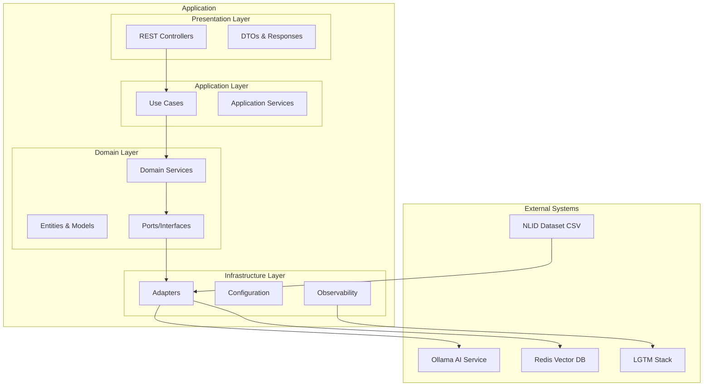

## 🎯 Clean Architecture Layers

### 1. Presentation Layer (`presentation/`)
**Responsibility**: Handle HTTP requests/responses and user interactions

#### Components:
- **Controllers**: REST endpoint handlers
- **DTOs**: Data transfer objects for API contracts
- **Exception Handlers**: Global error handling
- **Validators**: Input validation

#### Key Classes:
- `MovieController`: Movie search and retrieval endpoints
- `RAGController`: Question answering endpoints
- `ObservabilityController`: Health and metrics endpoints

```java
@RestController
@RequestMapping("/api/movies")
public class MovieController {

    private final ProcessMoviesUseCase processMoviesUseCase;

    @GetMapping("/search")
    public ResponseEntity<MovieSearchResponse> searchMovies(
        @RequestParam(required = false) String query,
        @RequestParam(required = false) String genre,
        @RequestParam(defaultValue = "20") int limit
    ) {
        // Delegate to use case
    }
}
```

### 2. Application Layer (`application/`)
**Responsibility**: Orchestrate business operations and use cases

#### Components:
- **Use Cases**: Application-specific business rules
- **Services**: Application services for complex operations
- **Command/Query Objects**: Request/response models

#### Key Classes:
- `ProcessMoviesUseCase`: Main movie processing orchestrator
- `ChunkingService`: Text chunking for embeddings
- `QuestionGenerationService`: Generate questions from content

```java
@Service
public class ProcessMoviesUseCase {

    public void processMovies(List<Movie> movies) {
        // 1. Chunk movie content
        // 2. Generate embeddings
        // 3. Store in vector database
        // 4. Generate questions
    }
}
```

### 3. Domain Layer (`domain/`)
**Responsibility**: Core business logic and rules

#### Components:
- **Entities**: Core business objects
- **Value Objects**: Immutable domain concepts
- **Ports**: Interface definitions
- **Domain Services**: Business logic services

#### Key Classes:
- `Movie`: Core movie entity
- `MovieChunk`: Text chunk with embeddings
- `Question`: Generated questions about movies
- `MovieRepositoryPort`: Repository abstraction
- `LLMServicePort`: AI service abstraction

```java
public class Movie {
    private String title;
    private String genre;
    private Double userRating;
    private String reviewHighlights;

    // Domain methods
    public boolean isHighlyRated() {
        return userRating != null && userRating >= 8.0;
    }

    public boolean isSuitableForFamily() {
        return percentageSuggestedToFriendsFamily >= 70.0;
    }
}
```

### 4. Infrastructure Layer (`infrastructure/`)
**Responsibility**: External system integrations and technical concerns

#### Components:
- **Adapters**: External system implementations
- **Configuration**: Framework and library setup
- **Observability**: Monitoring and logging

#### Key Classes:
- `OllamaLLMService`: Ollama AI integration
- `InMemoryVectorDatabase`: Vector storage implementation
- `CsvMovieLoader`: Dataset loading adapter
- `MetricsService`: Performance monitoring

## 🔄 Data Flow Architecture

### 1. Movie Processing Flow
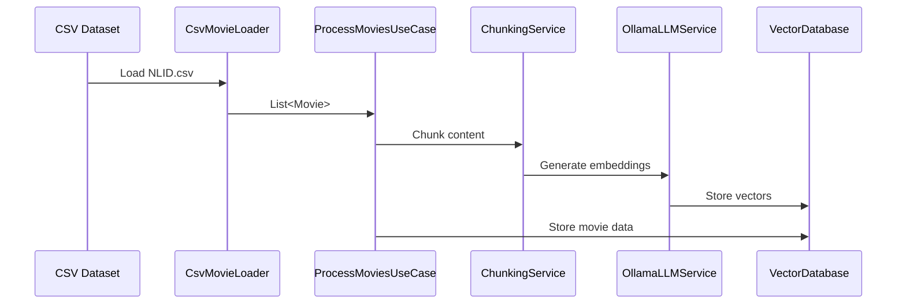

### 2. Search & Retrieval Flow
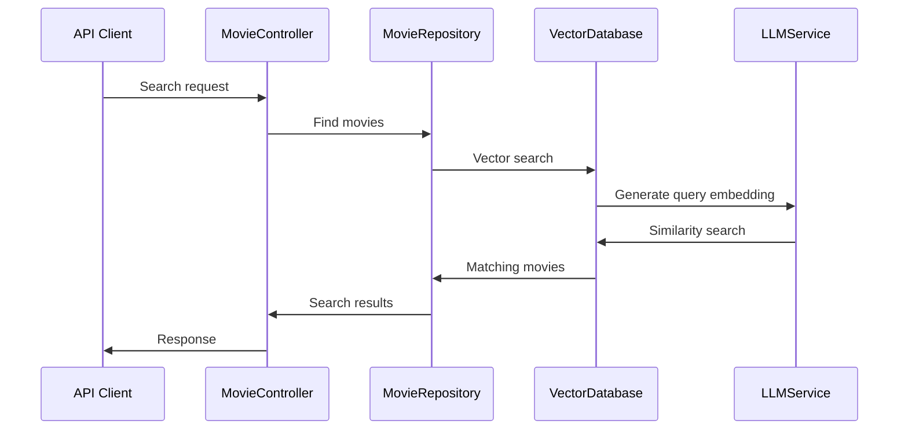

### 3. RAG Question Answering Flow
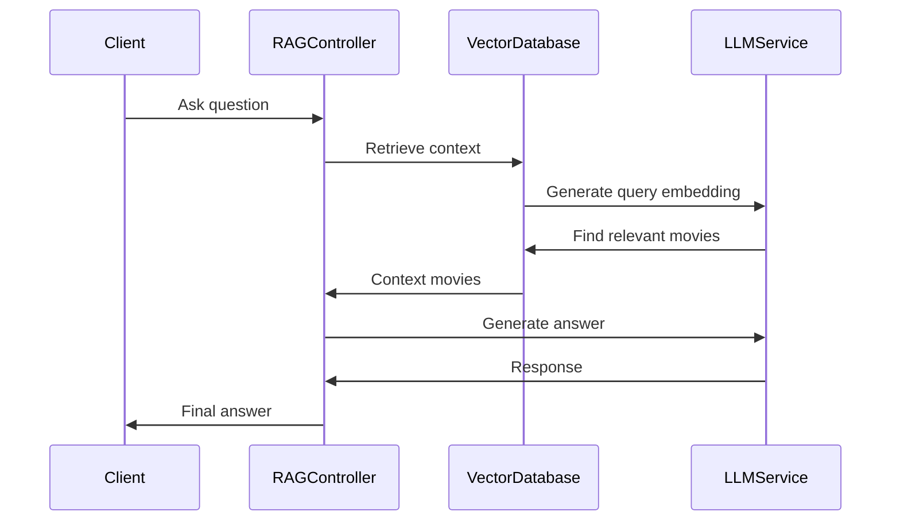

## 🧩 Component Architecture

### Core Components Interaction

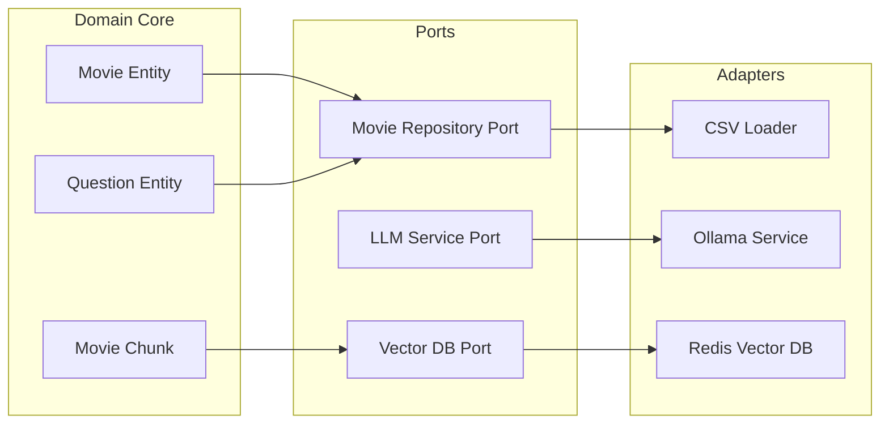

## 🚀 Deployment Architecture

### Local Development Environment
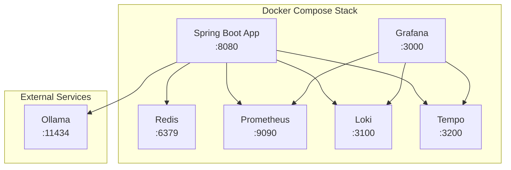

### Production Architecture (Planned)
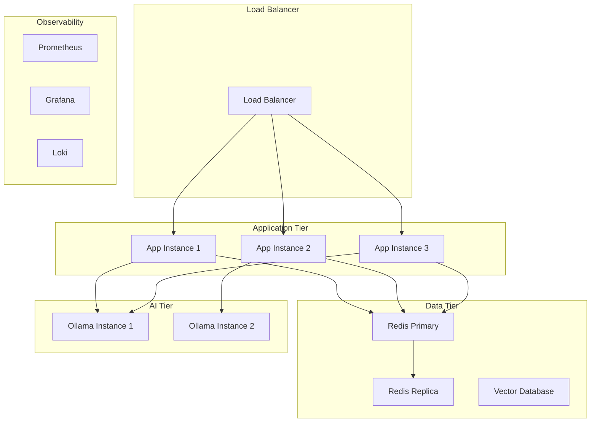

## 🔧 Configuration Architecture

### Property Management
```yaml
# Hierarchical configuration
application.properties (default)
├── application-dev.properties
├── application-test.properties
├── application-prod.properties
└── application-local.properties
```

### Configuration Classes
```java
@ConfigurationProperties(prefix = "app")
public class ApplicationProperties {

    private Processing processing = new Processing();
    private Search search = new Search();
    private Ollama ollama = new Ollama();

    @Data
    public static class Processing {
        private int batchSize = 50;
        private int parallelism = 4;
    }

    @Data
    public static class Search {
        private int defaultLimit = 20;
        private int maxLimit = 100;
        private double similarityThreshold = 0.7;
    }
}
```

## 📊 Performance Architecture

### Caching Strategy
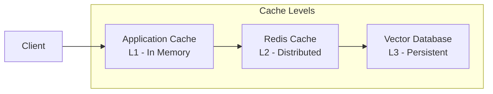

### Async Processing
```java
@Async("taskExecutor")
public CompletableFuture<List<MovieChunk>> processMovieChunks(Movie movie) {
    // Parallel chunk processing
    return CompletableFuture.completedFuture(chunks);
}
```

## 🔒 Security Architecture

### Current State
- **No Authentication**: Open API access
- **No Authorization**: All endpoints accessible
- **No Rate Limiting**: Unlimited requests

### Planned Security Architecture
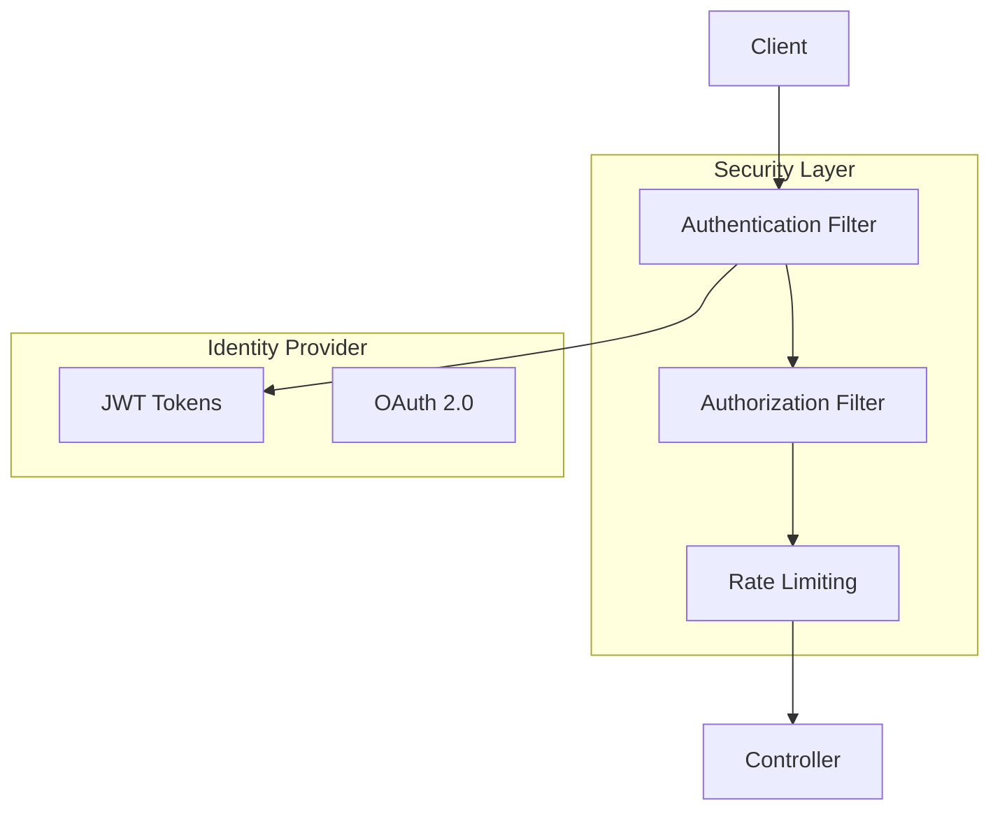

## 📈 Monitoring Architecture

### Observability Stack (LGTM)
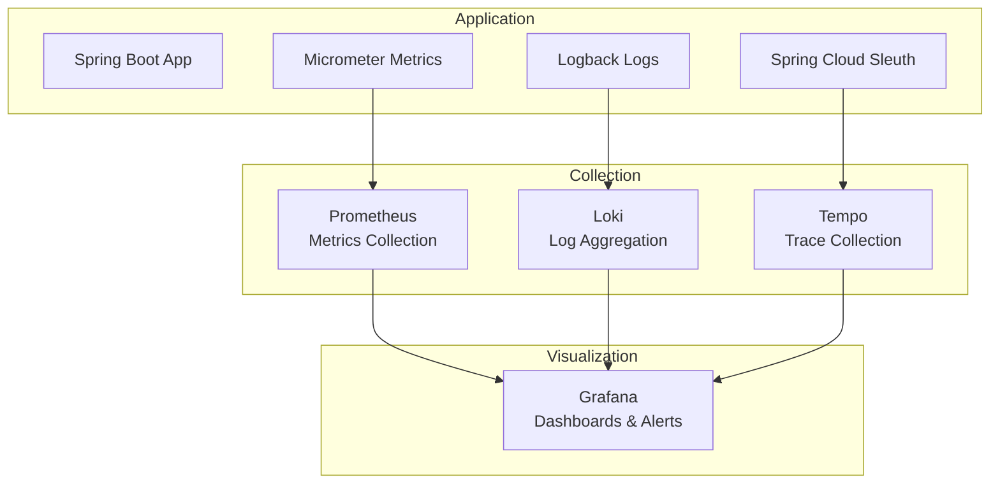

## 🧪 Testing Architecture

### Test Strategy
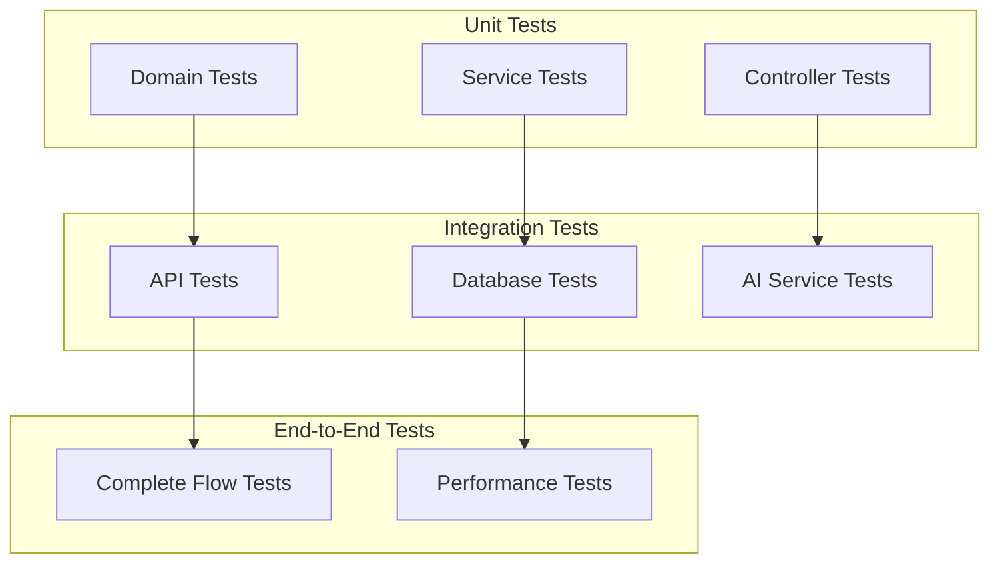

## 🔄 Evolution Strategy

### Phase 1: Foundation (Current)
- ✅ Clean Architecture implementation
- ✅ RAG system basics
- ✅ Basic observability

### Phase 2: Enhancement (Planned)
- 🔄 Security implementation
- 🔄 Performance optimization
- 🔄 Advanced caching

### Phase 3: Scale (Future)
- 📋 Microservices decomposition
- 📋 Event-driven architecture
- 📋 Multi-tenant support

---

**Next**: [🔌 API Documentation](./06-api-documentation.md)
